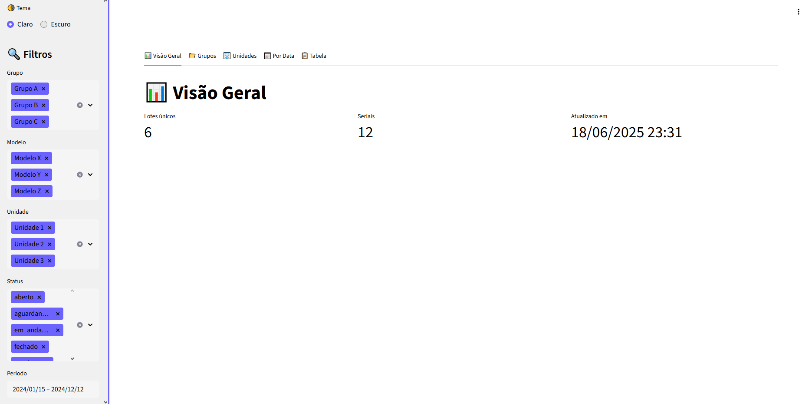
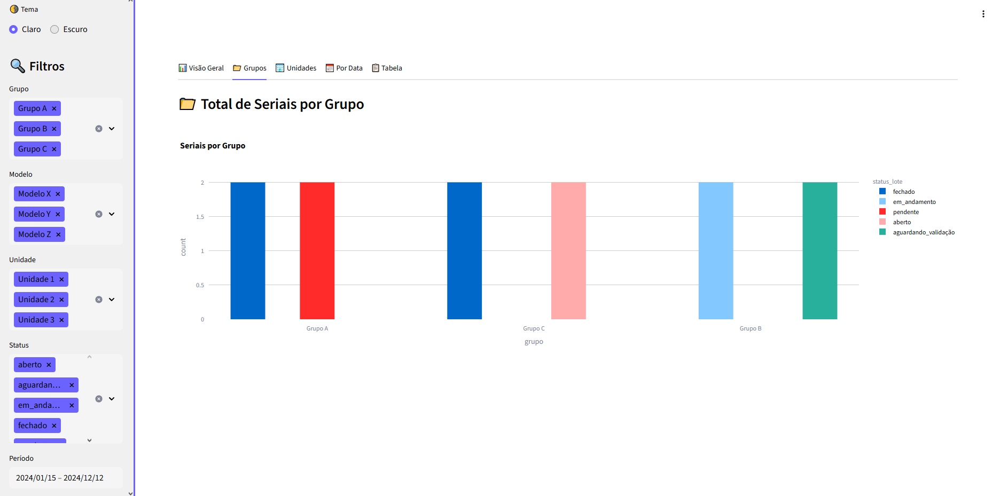
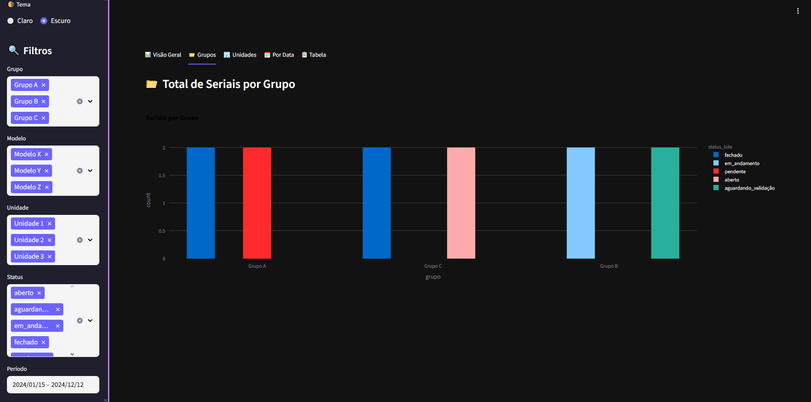
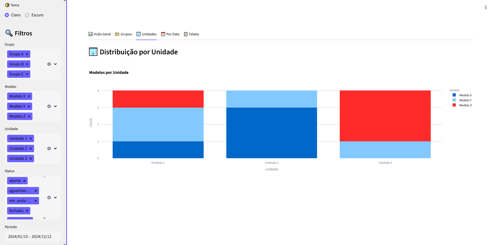
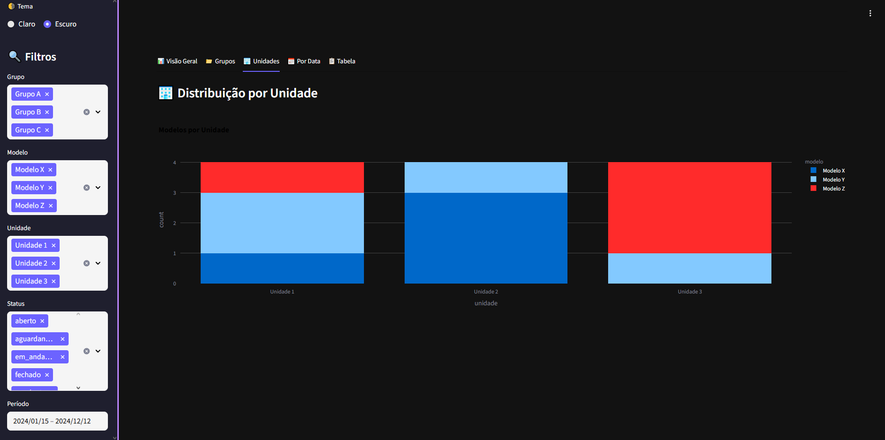
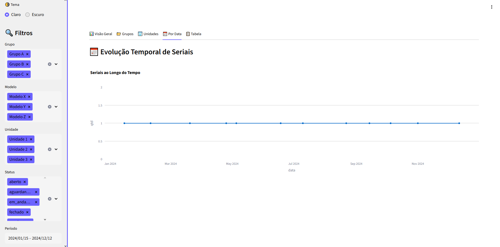
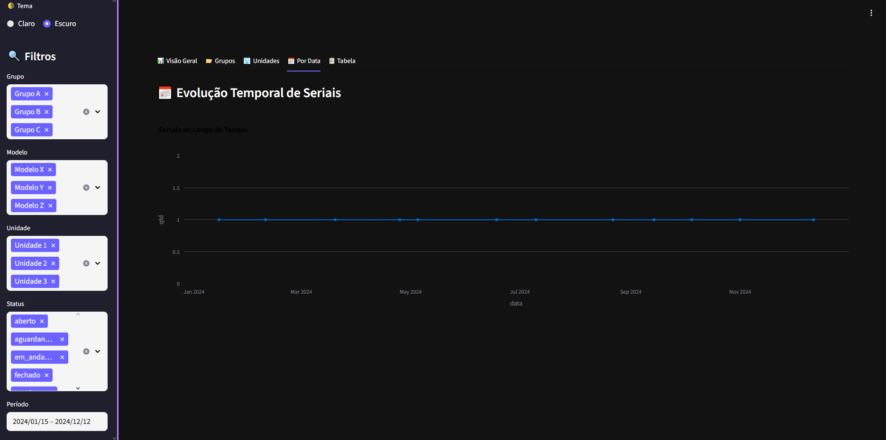
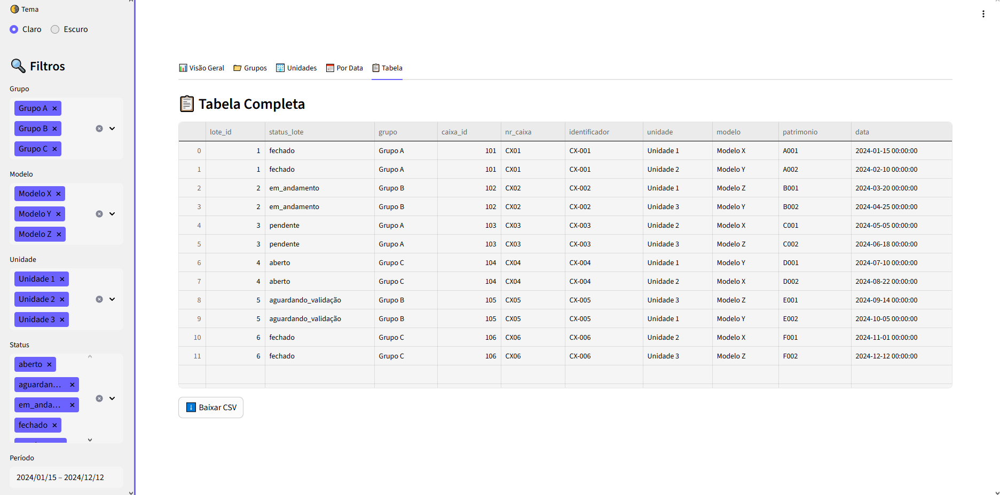
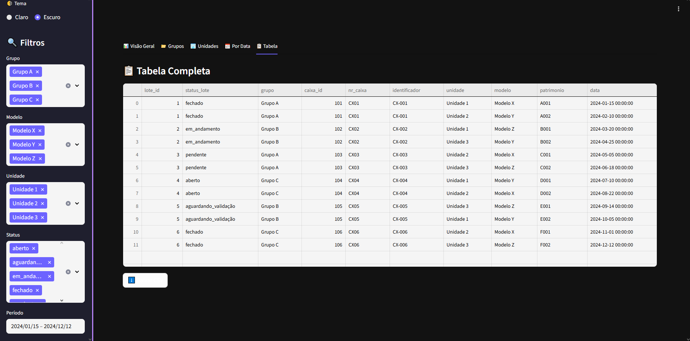

# 📊 Dashboard de Inventário com Streamlit

Este projeto é uma dashboard interativa desenvolvida com **Streamlit**, conectada a um arquivo `.json`, com recursos completos de análise, filtros dinâmicos, visualizações gráficas, modo claro/escuro, e muito mais.

## 🧰 Funcionalidades

✅ Leitura de dados a partir de um arquivo JSON  
✅ Filtros interativos por:
- **Grupo**
- **Modelo**
- **Unidade**
- **Status**
- **Período de Datas**

✅ Visualizações em abas:
- 📊 Visão Geral
- 📁 Grupos
- 🏢 Unidades
- 📅 Evolução Temporal
- 📋 Tabela Detalhada

✅ Alternância entre **modo Claro** e **modo Escuro**  
✅ Exportação de dados filtrados para CSV  
✅ Interface responsiva com layout limpo e sem fundo nos gráficos

## 🌗 Tema Dinâmico

A aplicação possui um botão lateral para mudar entre **modo Claro** e **modo Escuro**, alterando:

- Cor do menu lateral
- Cor dos textos
- Cor de fundo
- Estilo dos gráficos (sem fundo e com paleta adaptada)

## 📷 Screenshots

### 🎨 Tema Claro – Visão Geral  

### 🎨 Tema Escuro – Visão Geral  


### 🎨 Tema Claro – Grupos  

### 📁 Tema escuro – Unidades    


### 🏢 Tema escuro – Unidades  

### 🎨 Tema Claro – Evolução por Data    


### 🎨Tema Claro- Evolução por Data  

### 📅 Tema escuro – Tabela com Filtros  


### 🎨 Tema Claro -Tabela com Filtros  


### 📋Tema escuro – Visão Geral  



## 📁 Estrutura do Projeto

```
📦 dashboard-inventario/
├── main.py
├── dados.json
├── imgs/
│   ├── visao-geral.png
│   ├── grupos.png
│   ├── unidades.png
│   ├── data.png
│   └── tabela.png
└── README.md
```

## ✨ Personalização

Você pode adaptar os seguintes pontos:
- Paleta de cores no modo escuro/claro
- Adicionar mais filtros
- Conectar a banco de dados ou APIs
- Dockerização (futuramente)

## 📌 Requisitos

- Python 3.8+
- Streamlit
- Plotly
- Pandas

---